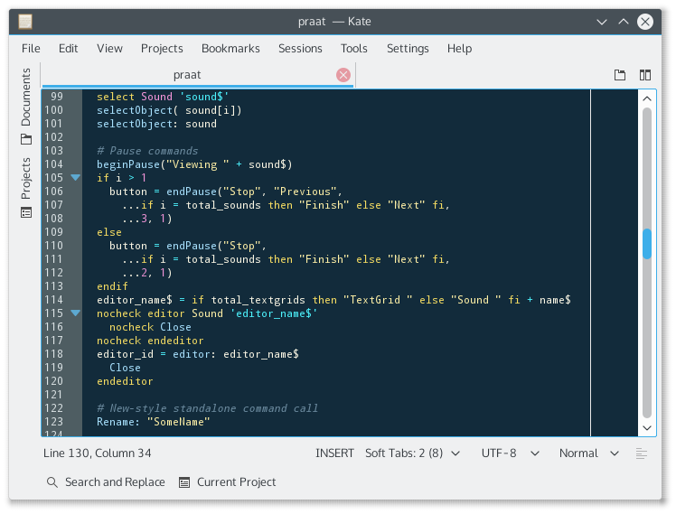

# praatKateSyntax

#### Praat syntax highlighting for Kate

## Features
* Accurate highlighting of most of Praat's commands,
  directives and functions, as well as predefined
  variables
* Code folding for all types of blocks
* Highlight of some (not all) unquoted string contexts (eg. `printline`)

## Installation

* Download `praat.xml`
* Save to the kate syntax folder. 

  For KDE4 this is one of the following
 
      # System-level
      /usr/share/kde4/apps/katepart/syntax  
      # User-level
      ~/.kde/share/apps/katepart/syntax

  For KDE5 this is at

      ~/.local/share/katepart5/syntax

* Restart Kate

The highlighting definition should be automatically selected for most
common Praat script file extensions. If not, it can be manually
selected from `Tools -> Highlighting -> Scripts -> Praat`.

## Known Issues

* Broken unquoted strings continue past blank lines:

      printline This is a string
        ... this also

        ... this shouldn't, but is.

* Broken quoted strings continue past closing quotes:

      a$ = "This is a string
        ... this also" + but_also_this$

### License

The utils plugin is free software: you can redistribute it
and/or modify it under the terms of the GNU General Public
License as published by the Free Software Foundation, either
version 3 of the License, or (at your option) any later version.

The utils plugin is distributed in the hope that it will be
useful, but WITHOUT ANY WARRANTY; without even the implied warranty
of MERCHANTABILITY or FITNESS FOR A PARTICULAR PURPOSE. See the
GNU General Public License for more details.

You should have received a copy of the GNU General Public License
along with utils. If not, see <http://www.gnu.org/licenses/>.

Copyright 2012-2016 Jose Joaquin Atria
